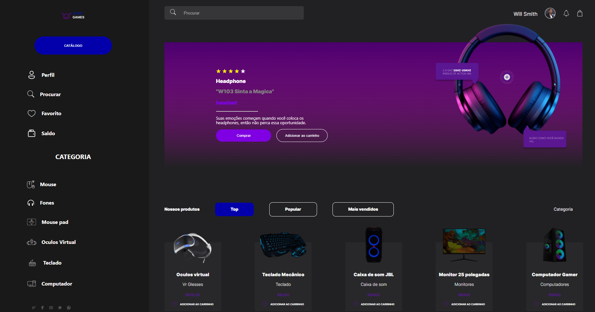

> Status: Finished ✅

<h1 align="center"> Good Game </h1>

A simple WebSite for an eletronics store. This WebSite is static because the object of this project was to work a litle much with JSX, React and SCSS.

 

  

<h2>🖱️ Technologies</h2>

This project was made with the following technologies:

 
   
  
      
  

 
<h2>🖥️ Depoly</h2>

To check the deploy, click [this link](https://good-game-vert.vercel.app).
 

## 📤 Installation

 

> <h3>Firstly, you need to <strong>clone the project</strong> on your machine:</h3>
>  

<code>git clone https://github.com/yuriclmoreira/good-game</code>

 

> <h3>After that, open the project folder and <strong>install the dependencies:</strong></h3>
>  

<code>npm i</code>

<code>yarn</code>

> <h3>To <strong>run the project</strong> on your browser, use</h3>

<code>npm start</code>

<code>yarn start</code>

 

<h2>Enjoy this project!</h2>

Developed by <strong>Yuri Moreira</strong>

